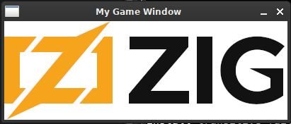

# SDL2 Zig Demo

Here's a basic window with SDL2 in Zig.



## How to build and run it

```
zig build run
```

## Cross-Compiling

Pass a `-Dtarget` option. For example:

```
zig build -Dtarget=x86_64-windows
```
